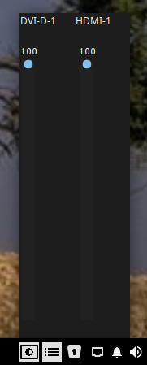

# brightness

A brightness control app for Solus Linux

Until now Solus has now app to control the display brightness. <i>brightness</i> uses xrandr to manage the display brightness.
</img> 
See src/main/resources/help.html for details.

See Wiki if you're unfamiliar with building a java app from source
  
